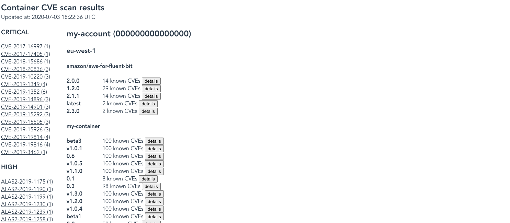

# ECR Scan Findings Aggregator


## Building
Check the Makefile.

The following command will build containers, apply terraform manifests, deploy
application to kubernetes.

```
aws-vault exec "aws-account-profile" -- make
```

## Directories

### trigger-scans
Will trigger periodic ECR scans, once per 24h
 
### collect-findings
Collects all ECR scan findings as stores the results as a JSON file in S3 and summaries in DynamoDB

### findings-notifier
Notifies Flowdock channel when HIGH or CRITICAL level findings are detected in DynamoDB stream, populated by collect-findings

### Web
Contains dashboard visualizing the vulnerable images across the AWS accounts.



The dashboard can be used to select all images containing specific CVEs.


### docker, kubernetes
Deployment and building of Nginx container, serving the web dashboard and
proxying connections to S3 to get the JSON file containing the vulnerabilities.
Configure the Nginx configuration file and Kubernetes deployment with required changed e.g., for your S3 bucket name and 
firewall rules.